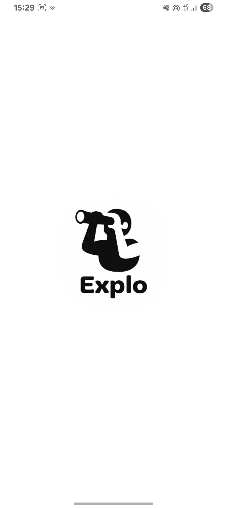
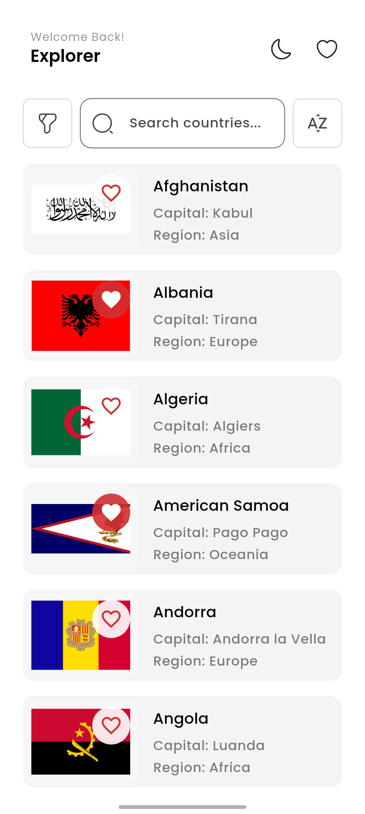
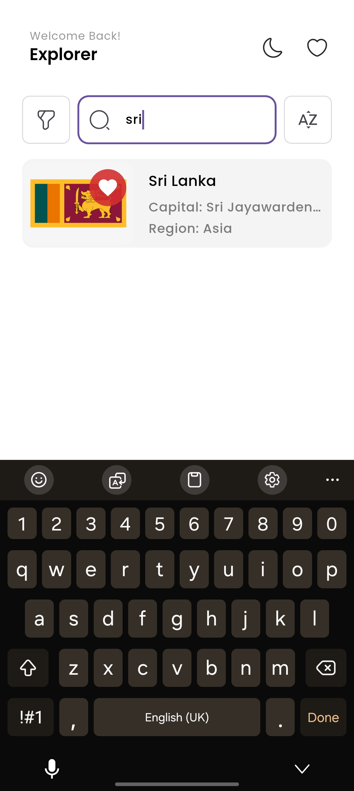
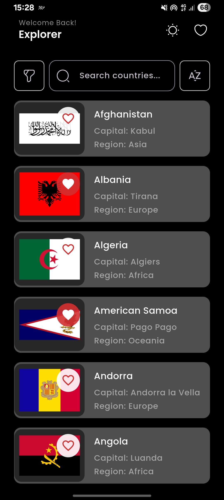
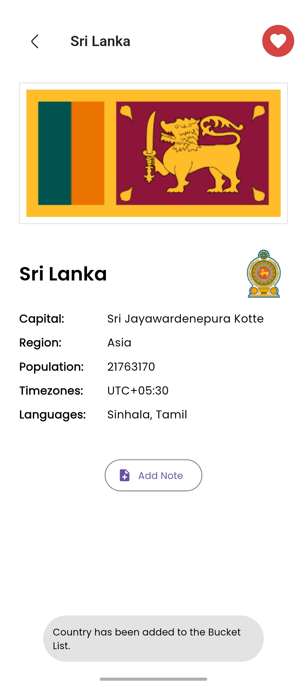
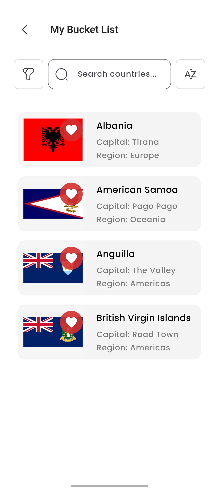

# 🌍 Country Explorer (Flutter)

A Flutter mobile app to browse countries from a public API, view details, add destinations to a bucket list, and save personal notes locally. 

---

## ✨ Features

- 🌐 Fetches country list from REST API  
- 🔍 Search, filter (by region), and sort (A–Z / Z–A)  
- 📄 Country details screen with flag, capital, region, population, timezones, languages, and coat of arms  
- 📝 Add, edit, delete personal notes per country (stored locally)  
- ⭐ Bucket List (favourites) stored offline using Hive  
- 🔄 Pull-to-refresh, shimmer loading, and error UI  
- 🌙 Dark mode toggle  
- 🖼️ Image caching for flags (`cached_network_image`)

---

## 📸 Screenshots

| Splash Screen | Home (Light) | Search |
|--------------|-------------|--------|
|  |  |  |

| Home (Dark) | Country Details | Bucket List |
|------------|----------------|-------------|
|  |  |  |


---

## 🛠️ Tech Stack & Dependencies

Key dependencies used in `pubspec.yaml`:

- ⚙️ `flutter` — SDK  
- 🔄 `get` — GetX state management  
- 🗄️ `hive`, `hive_flutter` — local storage  
- 🧬 `hive_generator`, `build_runner` — Hive code generation  
- 🖼️ `cached_network_image` — image caching  
- 🚀 `flutter_native_splash` — splash screen  
- 🎨 `google_fonts`, `iconsax_flutter`, `shimmer`  
- 🌐 `http`, `connectivity_plus`  
- 💾 `shared_preferences`, `path_provider`

---

## 🏗️ Folder & Architecture Overview

The project follows a **clean, modular MVC-inspired architecture**, where:
- Controllers manage logic & state
- Screens handle UI
- Services handle API & database interactions

```

lib/
├── api/
│   └── api_service.dart          # API calls (fetch countries)
├── controllers/
│   ├── base_country_controller.dart
│   ├── country_controller.dart
│   ├── favourites_controller.dart
│   ├── note_controller.dart
│   └── theme_controller.dart
├── db/
│   ├── bucketlist_db_service.dart
│   └── note_db_controller.dart
├── models/
│   └── country_model.dart
├── screens/
│   ├── home_screen.dart
│   ├── country_detail_screen.dart
│   └── bucket_list_screen.dart
├── utils/
│   ├── constants/
│   ├── helpers/
│   └── theme/
├── widgets/
│   └── reusable widgets (search, filters, shimmer, tiles)
├── main_app.dart
└── main.dart

````

---

## 🔄 State Management (GetX)

This project uses **GetX** for efficient and reactive state management.

### Controllers
- 📌 **CountryController**
  - Fetches countries
  - Handles search, filter, sort, refresh
- ⭐ **FavouritesController**
  - Manages bucket list logic
  - Persists data using Hive
- 📝 **NoteController**
  - Handles notes CRUD per country
- 🌙 **ThemeController**
  - Saves theme preference using `SharedPreferences`

### UI Binding
- Uses `Obx`, `GetBuilder`, and `GetX`
- Navigation via `Get.to()` and optional named routes

---

## ▶️ How to Run the App

### 📋 Prerequisites
- Flutter SDK (>= 3.x)
- Android Studio / VS Code
- Android emulator or real device
- Git installed

### ⚙️ Setup

1️⃣ Clone the repository
```bash
git clone <YOUR_REPO_URL>
cd <REPO_DIR>
````

2️⃣ Install dependencies

```bash
flutter pub get
```

3️⃣ Generate Hive adapters (if required)

```bash
flutter pub run build_runner build --delete-conflicting-outputs
```

4️⃣ Run the app

```bash
flutter run
```

---

## 📦 Build APK

### Release APK

```bash
flutter build apk --release
```

📍 Output:

```
build/app/outputs/flutter-apk/app-release.apk
```

### Debug APK

```bash
flutter build apk --debug
```

---

## 🌐 API Configuration

The app uses the REST Countries API.

📎 Endpoint used:

```
https://restcountries.com/v3.1/all?fields=name,capital,region,population,flags,coatOfArms,timezones,languages
```

You can update the base URL in:

```
lib/api/api_service.dart
```

---

## 💾 Local Storage (Hive)

* 🗃️ Hive initialized using `Hive.initFlutter()`
* 📦 Boxes used:

  * `bucketlistBox` — saved countries
  * `notesBox` — country-specific notes
* 🧠 Database logic is abstracted into DB service classes

---

## 🚫 Error Handling & Offline Support

* 📡 Network state checked using `connectivity_plus`
* ⚠️ Displays error UI on API failure
* ✅ Bucket list works fully offline

---

## 📤 App Demo

* 📸 **Screenshots:**
  Stored inside `screenshots/` folder

* 📱 **APK (Google Drive):**
  `https://drive.google.com/drive/folders/1c5FnseFxdpr5oGG-aZ8fiCEu10kraTgY?usp=drive_link`

---

```
